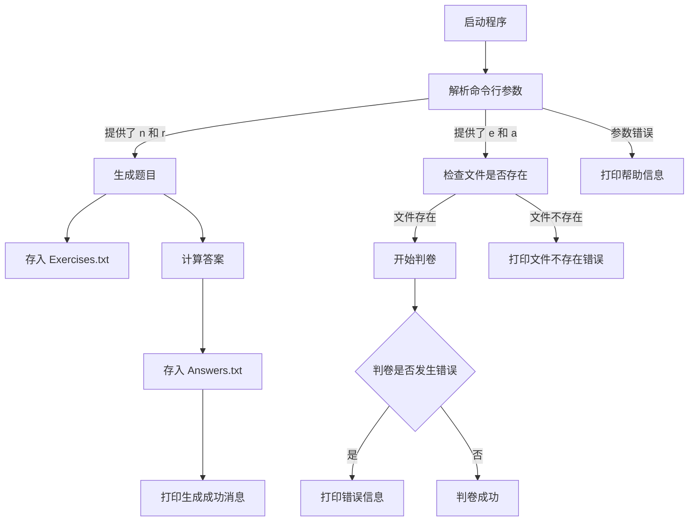
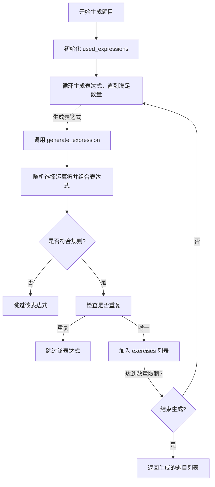
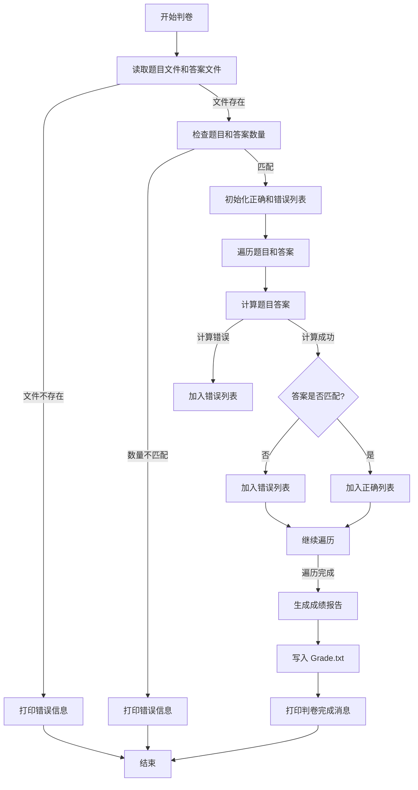
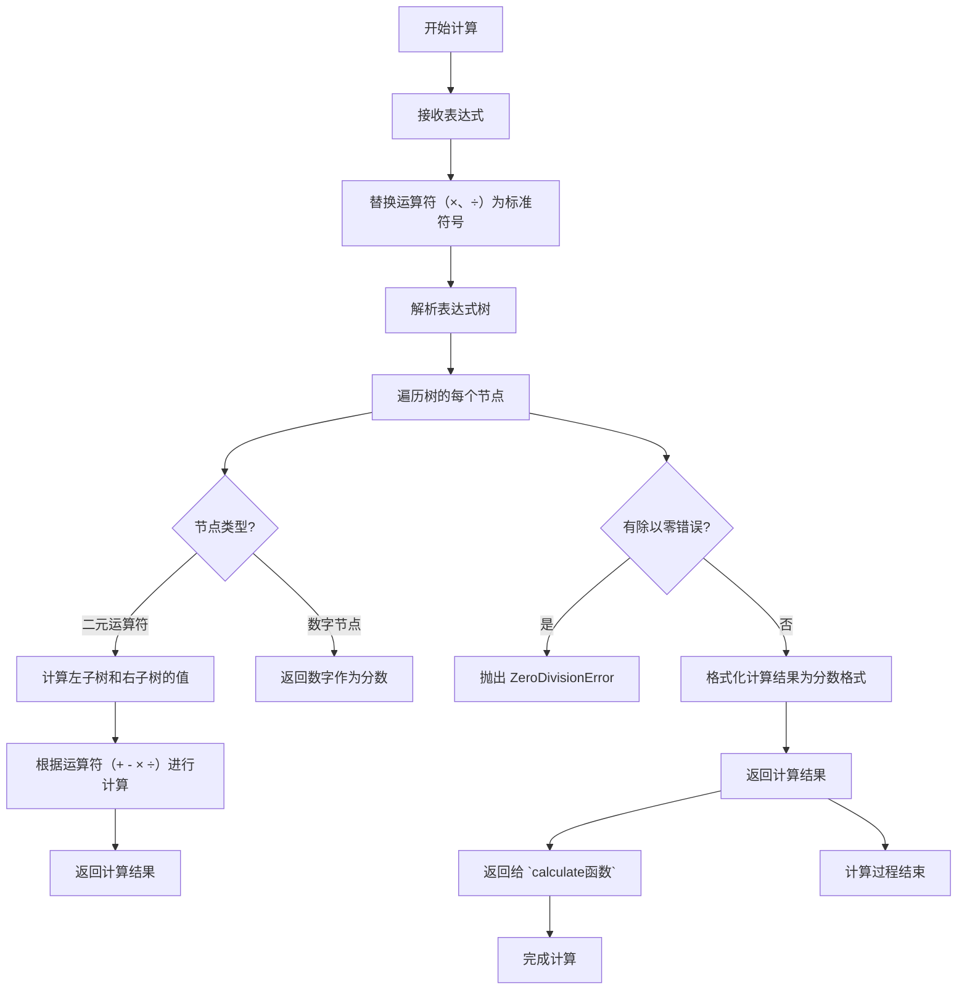
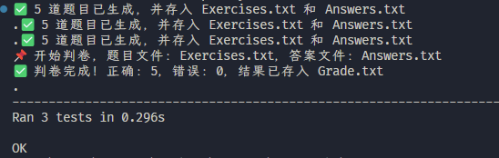
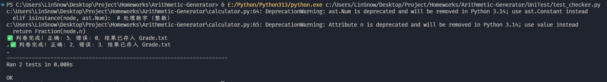

# 软件工程作业03-结对项目

| Info |                         Detail                          |
|:----:|:-------------------------------------------------------:|
|  成员  |              3123004449(林奕宏) / 3122004018（麦凯翔）       | 
| 作业要求 | 🔗[作业要求链接](https://edu.cnblogs.com/campus/gdgy/SoftwareEngineeringClassof2023/homework/13326) |
| 仓库链接 | 🔗[Github仓库传送门](https://github.com/MikeMak123/Arithmetic-Generator) |

---

# 程序运行

## 用法
- 生成题目并保存到文件
```shell
python main.py -n <题目数量> -r <数值范围>
```
- 批改题目与答案
```shell
python main.py -e Exercises.txt -a Answers.txt
```


# PSP2.1

| PSP2.1                                    | Personal Software Process Stages                 | 预估耗时（分钟） | 实际耗时（分钟） |
|:------------------------------------------|:-------------------------------------------------|:----------------:|:----------------:|
| **Planning**                              | 计划                                             |                  |                  |
| · _Estimate_                              | 估计这个任务需要多少时间                           |       30       |       30       |
| **Development**                           | 开发                                             |                  |                  |
| · _Analysis_                              | 需求分析 (包括学习新技术)                         |       20       |       15       |
| · _Design Spec_                           | 生成设计文档                                     |       15       |       20       |
| · _Design Review_                         | 设计复审                                         |       10       |       10       |
| · _Coding Standard_                       | 代码规范 (为目前的开发制定合适的规范)               |       10       |        5       |
| · _Design_                                | 具体设计                                         |       20       |       25       |
| · _Coding_                                | 具体编码                                         |       40       |       35       |
| · _Code Review_                           | 代码复审                                         |       15       |       10       |
| · _Test_                                  | 测试（自我测试，修改代码，提交修改）               |       30       |       40       |
| **Reporting**                             | 报告                                             |                  |                  |
| · _Test Report_                           | 测试报告                                         |       15       |       15       |
| · _Size Measurement_                      | 计算工作量                                       |        5       |        5       |
| · _Postmortem & Process Improvement Plan_ | 事后总结, 并提出过程改进计划                      |       10       |       15       |
| **Total**                                 | 合计                                             |      220       |      225       |


---

# 程序流程

```shell

📦
│  Answers.txt     # 答案文件
│  calculator.py   # 计算结果
│  checker.py      # 判卷并生成成绩报告
│  Exercises.txt   # 四则运算练习文件
│  generator.py    # 四则运算生成
│  Grade.txt       # 成绩文件
│  main.py         # 程序入口
│  utils.py        # 处理分数的四则运算
│
├─UniTest # 单元测试
│      test_calculator.py 
│      test_checker.py
│      test_generator.py
│      test_main.py
│      test_utils.py


```

---

# 程序




# 生成



# 判卷



# 计算


---

# 测试





